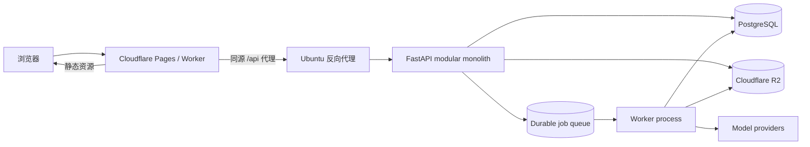

# 职途 AI 生产架构

## 1. 决策结论

项目采用“浏览器 SaaS + 模块化单体”的渐进重构路线：

- 前端：Vanilla TypeScript、Vite、Vitest、Playwright，静态产物部署到 Cloudflare。
- 后端：Python 3.11+、FastAPI、Pydantic、Uvicorn，部署到 Ubuntu。
- 数据：开发/兼容期使用 SQLite；生产迁移到 PostgreSQL。
- 文件：本地开发使用文件系统 adapter；生产使用 Cloudflare R2 adapter。
- 后台任务：短请求同步执行；模型分析、文档转换等长任务最终通过持久任务队列执行。
- 交付：`uv` 是 Python 依赖与运行命令的唯一权威来源，前端后续以 npm lockfile 固定依赖。

当前 FastAPI 通过 WSGI adapter 承载旧 Flask 路由。这是保持功能的迁移机制，不是最终形态。
在认证、用户隔离和 PostgreSQL 完成前，现有单用户运行时不得直接暴露到公网。

## 2. 为什么选择 FastAPI

FastAPI 是本项目后端的目标框架，优势集中在维护性：

- 请求/响应模型、校验和 OpenAPI 来自同一个类型接口，减少手写契约漂移。
- ASGI 原生支持异步 I/O、SSE/WebSocket 和长任务状态查询。
- dependency 机制适合集中实现身份、授权、数据库事务和审计。
- application factory、lifespan 与测试 client 能形成稳定的运行 seam。
- 保留 Python 领域逻辑，无需为换框架重写已有业务规则。

不采用微服务。当前团队和业务规模下，微服务会增加部署、事务、追踪和版本协调成本，却不会自动改善模块职责。先建立清晰的内部 module，再根据真实容量或组织边界拆服务。

## 3. 目标拓扑



优先采用 Cloudflare 同源 `/api` 代理，浏览器只认识一个站点来源。若使用独立 API 域名，必须同时配置精确 CORS allowlist、可信 Host、TLS 和认证凭据；禁止 `*` Origin。

## 4. 后端 module

```text
backend/
  main.py                 application factory / composition root
  cli.py                  cross-platform runtime entry
  core/
    settings.py           environment configuration
    security.py           target: principal/auth/policy
    observability.py      target: logging/metrics/tracing
  api/
    system.py             health/readiness
    v1/                   target: domain routers
  domains/
    opportunities/        target: use cases + domain rules
    interviews/
    resumes/
    agent/
  adapters/
    legacy_flask.py       temporary WSGI compatibility adapter
    persistence/          target: SQLite/PostgreSQL adapters
    storage/              target: local/R2 adapters
```

路由只负责协议转换。业务不变量、事务和幂等性属于 domain module；SQL、R2 和模型供应商是 adapter。测试与调用方通过同一个 public interface 验证行为，不跨 module 读取内部表或全局变量。

迁移顺序是 Opportunity → Interview → Resume → Agent：

1. Opportunity 和 Interview 已有较清晰的领域实现与行为测试，先建立原生 FastAPI 模板。
2. Resume 先把文件、转换、AI 分析和持久化拆成用例，再迁路由。
3. Agent 最后迁移，因为它依赖身份、长任务、记忆、提案确认和多个业务域。

每次迁移只允许一个写入路径；FastAPI 与 Flask 不做双写。一个域的契约测试通过后，删除对应 Flask route，最终删除 WSGI adapter 和 `app.py`。

## 5. 身份与安全

当前已建立最外层 Principal seam：本地模式生成固定开发身份；Ubuntu
可验证 Cloudflare Access JWT，并通过受众与邮箱 allowlist 映射到当前兼容用户。
这使单用户在线部署具备可信入口，但 PostgreSQL 多租户 owner 映射仍未完成：

- 浏览器获得短期 session/token；服务端从可信凭据生成 `Principal`。
- 业务代码只接受可信 principal，不接受浏览器提交的 `user_id`。
- 所有查询和文件访问必须带 owner/tenant 条件。
- Agent 写动作继续使用“提案 → 预览 → 确认 → 幂等回执”，但 Origin 检查不能替代身份认证。
- AI Key 不允许由普通公开端点修改进程全局配置；生产凭据来自 secret manager/environment。
- 上传校验 MIME、扩展名、大小、文件名和对象 owner；下载使用短时签名 URL 或授权流。
- 反向代理设置请求体上限、超时、速率限制和安全响应头。

认证 middleware 位于最外层 ASGI seam，原生 FastAPI router 与临时 WSGI
adapter 均受保护；只有 `/api/v1/healthz` 和 CORS preflight 免认证。

## 6. 数据、文件与后台任务

SQLite 保留为单机开发 adapter，固定单 worker。生产使用 PostgreSQL：

- Alembic 迁移由部署步骤单独执行，应用 worker 启动时只检查 schema 版本。
- 每个业务用例拥有明确事务；领域事件和业务写入在同一事务提交。
- 连接池、查询超时、唯一约束和幂等键由数据库保障。
- 备份、恢复演练和回滚脚本属于发布门禁。

R2 保存原始文件与导出物，PostgreSQL 只保存对象 key、owner、类型、大小、校验和与生命周期状态。后台任务保存 durable 状态，浏览器以 `202 + task_id` 轮询或 SSE 获取进度，避免 Cloudflare/反向代理等待长同步请求。

## 7. 前端 module

当前经典脚本按以下顺序渐进迁移，避免同时改变业务归属、事件机制和构建系统：

```text
src/
  app/                    composition root, routing, shared shell
  platform/
    api-client.ts         HTTP/error/auth/timeout
    browser.ts            media/download/capability adapters
  features/
    resume/
    interview/
    opportunity/
    agent/
  shared/
    ui/
    types/
```

第一阶段已把所有 JSON 请求以及下载请求的 transport 收进 `ApiClient`。后续按 Resume → Interview → Opportunity → Agent 迁移 controller；每个 controller 只拥有本域状态，通过不可变 handoff 或显式 interface 与其他域协作。

四个域稳定后，再完成两项机械迁移：

1. 把内联 `onclick` 改为 `data-action` 事件委托，消除全局函数依赖。
2. 切换到 TypeScript/Vite ESM，开启 `strict`、ESLint、Vitest 和构建产物 hash。

Cloudflare 只接收 Vite 的 `dist/`，不托管 Python、SQLite 或用户上传。

## 8. 运行与配置

跨平台开发不依赖 PowerShell：

```bash
uv sync --frozen
uv run python -m backend.cli
```

生产推荐由进程管理器运行同一 entry，后端只绑定 Ubuntu 回环地址，由反向代理对外提供 TLS：

```bash
JOBHUNTER_ENV=production \
JOBHUNTER_HOST=127.0.0.1 \
JOBHUNTER_PORT=8000 \
JOBHUNTER_AUTH_MODE=cloudflare_access \
JOBHUNTER_CF_ACCESS_TEAM_DOMAIN=team.cloudflareaccess.com \
JOBHUNTER_CF_ACCESS_AUDIENCE=replace-with-access-aud \
JOBHUNTER_ALLOWED_IDENTITY_EMAILS=owner@example.com \
JOBHUNTER_ALLOWED_HOSTS=api.example.com \
JOBHUNTER_ALLOWED_ORIGINS=https://career.example.com \
uv run python -m backend.cli
```

兼容期必须保持 `JOBHUNTER_WORKERS=1`。Cloudflare Access 模式强制要求
`JOBHUNTER_ALLOWED_HOSTS` 与 `JOBHUNTER_ALLOWED_ORIGINS` 为显式非通配符；
生产默认关闭 OpenAPI UI。反向代理必须保留
`Cf-Access-Jwt-Assertion` 请求头。

### Ubuntu 容器运行

仓库提供同一套 OCI 镜像和 Compose 配置，Windows/macOS 可用 Docker
Desktop 验证，Ubuntu 使用 Docker Engine 运行，不依赖 PowerShell：

```bash
cp deploy/backend.env.example deploy/backend.env
# 编辑域名、Cloudflare Access audience 和邮箱 allowlist
docker compose config
docker compose build backend
docker compose up -d backend
docker compose ps
```

容器使用非 root 用户、只读根文件系统、移除 Linux capabilities，并把
SQLite、上传、导出和运行时配置集中挂载到 `/app/data`。宿主机端口只绑定
`127.0.0.1:8000`，应由 Cloudflare Tunnel 或反向代理提供公网 TLS；不要把
Compose 的端口映射改为 `0.0.0.0`。生产数据库切换到 PostgreSQL 后才允许
增加 worker 数量。

## 9. 可观测性与发布门禁

目标门禁：

- 每个请求生成 request ID，结构化 JSON 日志不包含简历正文、Key 或个人联系方式。
- 指标至少覆盖请求率、错误率、P95、任务积压、模型错误、数据库池和存储失败。
- `/api/v1/healthz` 只证明进程存活；`/api/v1/readyz` 检查 schema、数据库和关键存储。
- CI 覆盖 Python 3.11/3.12/3.13、Node LTS、Ubuntu/Windows/macOS 的静态与单元测试。
- Playwright 覆盖 Chromium/Firefox/WebKit 的关键用户流程。
- Cloudflare preview + Ubuntu staging 验证真实 Origin、认证、上传、下载、任务恢复和回滚。

任何迁移批次都必须保持：窄测试绿 → 受影响回归绿 → 全量测试绿 → 浏览器关键流程绿。不能用“文件拆小了”替代行为等价证明。
