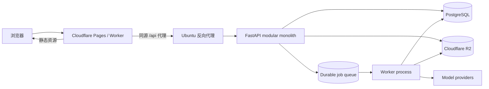

# 职途 AI 生产架构

## 1. 决策结论

项目采用“浏览器 SaaS + 模块化单体”的渐进重构路线：

- 前端：React 19、strict TypeScript、Vite、Vitest、Playwright；静态产物部署到 Cloudflare Pages。
- 后端：Python 3.11+、FastAPI、Pydantic、Uvicorn；模块化单体部署到 Ubuntu。
- 数据：SQLAlchemy 2 + Alembic；本地使用 SQLite，生产使用 PostgreSQL。
- 文件：文件操作通过 storage port；当前 local adapter 可用于单机部署，达到多实例需求后再增加 R2 adapter。
- 后台任务：短请求同步执行；只有跨代理超时或需要故障恢复的长任务才引入持久任务队列。
- 交付：`uv` + `uv.lock` 和 npm + `package-lock.json` 分别是 Python、前端的唯一依赖契约。

Flask、WSGI adapter、PowerShell/批处理启动链和旧浏览器 controller 已移除。所有 HTTP
路由由 FastAPI 原生实现，前端运行在单一 ESM module graph 中。生产公开访问仍必须通过
Cloudflare Access 或等价可信身份层；不得以 `local` 认证模式直接绑定公网地址。

## 2. 为什么选择 FastAPI

FastAPI 是本项目后端的目标框架，优势集中在维护性：

- 请求/响应模型、校验和 OpenAPI 来自同一个类型接口，减少手写契约漂移。
- ASGI 原生支持异步 I/O、SSE/WebSocket 和长任务状态查询。
- dependency 机制适合集中实现身份、授权、数据库事务和审计。
- application factory、lifespan 与测试 client 能形成稳定的运行 seam。
- 保留 Python 领域逻辑，无需为换框架重写已有业务规则。

不采用微服务。当前团队和业务规模下，微服务会增加部署、事务、追踪和版本协调成本，却不会自动改善模块职责。先建立清晰的内部 module，再根据真实容量或组织边界拆服务。

## 3. 目标拓扑



优先采用 Cloudflare 同源 `/api` 代理，浏览器只认识一个站点来源。若使用独立 API 域名，必须同时配置精确 CORS allowlist、可信 Host、TLS 和认证凭据；禁止 `*` Origin。

## 4. 后端 module

```text
backend/
  main.py                 application factory / composition root
  cli.py                  cross-platform runtime entry
  core/
    settings.py           environment configuration
    security.py           target: principal/auth/policy
    observability.py      target: logging/metrics/tracing
  api/
    system.py             health/readiness
    v1/                   target: domain routers
  application/            use cases + domain rules
  ports/                  persistence / storage interfaces
  adapters/
    persistence/
      sqlalchemy/         SQLite/PostgreSQL adapters + unit of work
    storage/              local adapter; R2 adapter is an optional future implementation
  alembic/                versioned schema migrations
```

路由只负责协议转换。业务不变量、事务和幂等性属于 application module；SQL、文件系统
和模型供应商属于 adapter。测试与调用方通过同一个 public interface 验证行为，不跨
module 读取内部表或进程全局状态。只有存在第二种真实实现时才增加新的 port，避免制造
浅层转发 module。

## 5. 身份与安全

最外层 Principal seam 支持两种 adapter：本地开发固定身份；Ubuntu 验证 Cloudflare
Access JWT，并通过受众与邮箱 allowlist 映射到授权用户。当前在线部署按单租户设计；
若未来开放多人使用，必须先完成账号与 tenant 映射：

- 浏览器获得短期 session/token；服务端从可信凭据生成 `Principal`。
- 业务代码只接受可信 principal，不接受浏览器提交的 `user_id`。
- 所有查询和文件访问必须带 owner/tenant 条件。
- Agent 写动作继续使用“提案 → 预览 → 确认 → 幂等回执”，但 Origin 检查不能替代身份认证。
- AI Key 不允许由普通公开端点修改进程全局配置；生产凭据来自 secret manager/environment。
- 上传校验 MIME、扩展名、大小、文件名和对象 owner；下载使用短时签名 URL 或授权流。
- 反向代理设置请求体上限、超时、速率限制和安全响应头。

认证 middleware 位于最外层 ASGI seam；只有 `/api/v1/healthz` 和 CORS preflight
免认证。

## 6. 数据、文件与后台任务

SQLite 保留为单机开发 adapter，固定单 worker。PostgreSQL 通过相同 repository / unit
of work interface 接入生产：

- Alembic 迁移由部署步骤单独执行，应用 worker 启动时只检查 schema 版本。
- 每个业务用例拥有明确事务；领域事件和业务写入在同一事务提交。
- 连接池、查询超时、唯一约束和幂等键由数据库保障。
- 备份、恢复演练和回滚脚本属于发布门禁。

R2 保存原始文件与导出物，PostgreSQL 只保存对象 key、owner、类型、大小、校验和与生命周期状态。后台任务保存 durable 状态，浏览器以 `202 + task_id` 轮询或 SSE 获取进度，避免 Cloudflare/反向代理等待长同步请求。

## 7. 前端 module

```text
frontend/src/
  app/                    composition root, routing, shared shell
  shell/                  navigation and topbar
  shared/                 HTTP/error UI/browser event interfaces
  resume/                 resume workflow
  interview/              interview and media workflow
  opportunity/            application and opportunity workflow
  agent/                  conversation, proposal and command-center workflow
```

所有 JSON、文件上传和下载 transport 统一通过 `ApiClient`。动态操作使用
`data-command` 事件委托；页面不依赖全局函数名。各 workflow 只拥有本域状态，通过
显式 handoff interface 协作。React 只作为 composition root 和可独立演进的视图入口，
现有 DOM class/id 与页面视觉保持不变。

Cloudflare 只接收 Vite 的 `dist/`，不托管 Python、SQLite 或用户上传。

## 8. 运行与配置

跨平台开发不依赖 PowerShell：

```bash
uv sync --frozen
uv run python -m backend.cli
```

生产推荐由进程管理器运行同一 entry，后端只绑定 Ubuntu 回环地址，由反向代理对外提供 TLS：

```bash
JOBHUNTER_ENV=production \
JOBHUNTER_HOST=127.0.0.1 \
JOBHUNTER_PORT=8000 \
JOBHUNTER_AUTH_MODE=cloudflare_access \
JOBHUNTER_CF_ACCESS_TEAM_DOMAIN=team.cloudflareaccess.com \
JOBHUNTER_CF_ACCESS_AUDIENCE=replace-with-access-aud \
JOBHUNTER_ALLOWED_IDENTITY_EMAILS=owner@example.com \
JOBHUNTER_ALLOWED_HOSTS=api.example.com \
JOBHUNTER_ALLOWED_ORIGINS=https://career.example.com \
uv run python -m backend.cli
```

SQLite 模式必须保持 `JOBHUNTER_WORKERS=1`；PostgreSQL 可在完成并发压测后增加
worker。Cloudflare Access 模式强制要求
`JOBHUNTER_ALLOWED_HOSTS` 与 `JOBHUNTER_ALLOWED_ORIGINS` 为显式非通配符；
生产默认关闭 OpenAPI UI。反向代理必须保留
`Cf-Access-Jwt-Assertion` 请求头。

### Ubuntu 直接运行

当前阶段不引入 Docker。Windows、macOS 和 Ubuntu 统一使用 `uv` 管理 Python
版本、锁定依赖和启动命令，避免维护多套 PowerShell、shell 与容器入口。
Ubuntu 使用普通非 root 应用用户安装 `uv`，在发布目录中执行：

```bash
uv sync --frozen --no-dev
uv run python -m backend.cli
```

进程管理器只负责注入环境变量、自动重启、日志轮转和启动上述命令，不复制业务
配置。运行数据、上传和导出目录放在发布目录之外的持久路径，并通过
`JOBHUNTER_DB_PATH`、`JOBHUNTER_UPLOAD_FOLDER` 与
`JOBHUNTER_EXPORT_FOLDER` 显式配置。后端只监听 `127.0.0.1:8000`，由
Cloudflare Tunnel 或反向代理提供公网 TLS。生产数据库切换到 PostgreSQL
且完成并发验证后，才允许增加 worker 数量。

## 9. 可观测性与发布门禁

目标门禁：

- 每个请求生成 request ID，结构化 JSON 日志不包含简历正文、Key 或个人联系方式。
- 指标至少覆盖请求率、错误率、P95、任务积压、模型错误、数据库池和存储失败。
- `/api/v1/healthz` 只证明进程存活；`/api/v1/readyz` 检查 schema、数据库和关键存储。
- CI 覆盖 Python 3.11/3.12/3.13、Node LTS、Ubuntu/Windows/macOS 的静态与单元测试。
- Playwright 覆盖 Chromium/Firefox/WebKit 的关键用户流程。
- Cloudflare preview + Ubuntu staging 验证真实 Origin、认证、上传、下载、任务恢复和回滚。

任何迁移批次都必须保持：窄测试绿 → 受影响回归绿 → 全量测试绿 → 浏览器关键流程绿。不能用“文件拆小了”替代行为等价证明。
